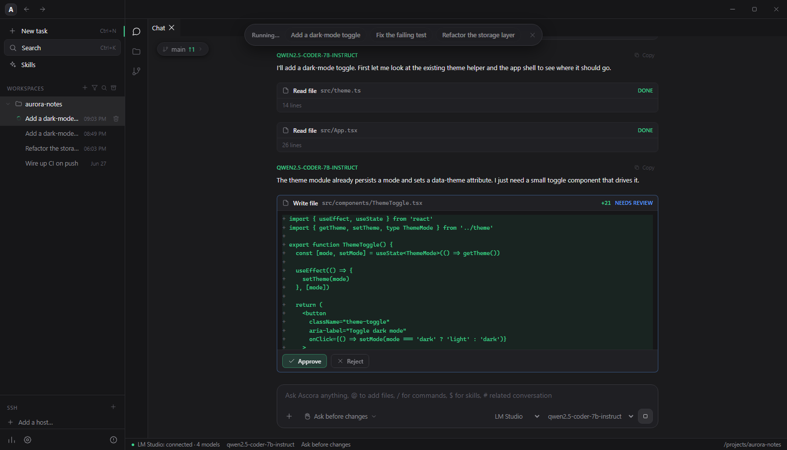

# Ascora ADE

**Agentic Development Environment** — a cross-platform desktop IDE with an AI agent
inside it. Describe a task in plain language; Ascora ADE reads your code, plans,
edits files, runs commands, and shows a **diff before applying** — powered by the
models you run yourself. Local-first, offline-capable, and entirely in your control.



This repository is the **release / distribution channel**: it hosts the prebuilt,
ready-to-run binaries and their checksums. The application and website source live
in their own repositories under the [AS-CoreAI](https://github.com/AS-CoreAI) org.

- **Live demo & downloads:** https://ade.ascoreai.com/
- **Current version:** 1.2.3
- **Platforms:** Windows (x64), Linux (x64)

## What's new in 1.2.3

- **Blueprint automation studio** — build project-independent multi-agent
  workflows on a visual node graph with conditional routing, bounded Repeat
  loops, notes, scheduled runs, Telegram delivery, webhooks, and a shared
  Blueprint Hub chat.
- **Agent mode for Blueprints** — agents can iterate with workspace file/search/
  edit/shell tools plus `web_search` and `web_fetch`; every tool call is preserved
  in the execution audit trail.
- **Attachment chips and image previews** — attach files or images without
  cluttering the visible message with transport-only `@path` blocks.
- **Codex and Claude account controls** — backend settings now show the authorized
  account and provide working Sign in / Sign out actions.
- **A proper Git diff experience** — Monaco syntax highlighting, old/new line
  gutters, per-file addition/removal counts, binary badges, and a readable split
  layout.
- **More capable workspace search** — regex, glob, context, and case-sensitive
  modes are available locally and over SSH.
- **Richer analytics** — estimated API-equivalent cost, model share over time,
  hourly activity heatmaps, localized charts, and expandable per-project model
  usage.
- **Task archive and workspace improvements** — browse and restore archived
  tasks, rename workspace projects, and collapse or expand all workspaces at once.
- **More languages and models** — Ukrainian, German, French, and Italian join
  English and Russian; Codex presets now include `gpt-5.6-terra`,
  `gpt-5.6-lunna`, and `gpt-5.6-sol`.
- **Reliability fixes** — invalid scheduled graphs are surfaced, repeated steps
  no longer show stale text, agent tool parsing is consistent, and WProvider
  authentication/cancellation behavior is more robust across supported services.

See the full changelog in the [release notes](https://github.com/AS-CoreAI/Ascora-ADE/releases/tag/v1.2.3).

## Supported models — one agent, every backend

Switch provider and model per task from the composer; each chat remembers its
own choice.

| Backend | Models | Connection | Notes |
| --- | --- | --- | --- |
| **LM Studio** *(default)* | any local model you load (e.g. `qwen2.5-coder`) | OpenAI-compatible HTTP API (`http://localhost:1234/v1`), SSE streaming | Fully offline — your code never leaves the machine |
| **Ollama** | any local model you pull | OpenAI-compatible HTTP API (`http://localhost:11434/v1`), SSE streaming | Fully offline; probed in the background like LM Studio |
| **Ascora WProvider** | **Qwen · DeepSeek · Alice · Mistral · Claude · Grok · Gemini · ChatGPT** | provider's own web chat via a hidden browser window | Sign in once in a visible window; per-service sign-in status; works over SSH |
| **OpenRouter** | any hosted model on OpenRouter | OpenAI-compatible cloud API with your API key | Optional cloud backend |
| **Claude Code** | Claude **Opus · Sonnet · Haiku · Fable** | local `claude` CLI (auto-detected) | Selectable permission mode (e.g. accept-edits); aliases resolve to the newest model of each family |
| **Codex** | OpenAI **GPT‑5.x**, including the **GPT‑5.6** presets | local `codex` CLI (auto-detected) | Sandbox policy + reasoning-effort control |
| **Gemini CLI** | Google **Gemini** | local `gemini` CLI | Approval modes: plan / default / auto_edit / yolo; session resume |
| **GLM / ZCode** | Zhipu **GLM** (e.g. `glm‑4.6`) | bundled ZCode agent (auto-detected) | Permission modes: plan / build / edit / yolo |

> **Bring your own model.** Run fully offline against a local LLM via LM Studio or
> Ollama, delegate a task to the Codex, Claude Code, Gemini, or GLM/ZCode CLI
> agents, or drive a provider's web chat directly through Ascora WProvider. Nothing
> is uploaded unless you choose a hosted backend.

## Features

- **Agentic edit loop** — read → plan → edit → run → verify, in one place.
- **Diffs before disk** — every change is shown as a side-by-side diff you can
  approve or reject; or switch to **Auto-apply** to let a task run end to end.
- **Transparent reasoning** — collapsible thought process, streaming tool cards
  (output, diffs, exit codes), and a live token + time counter.
- **Monaco editor** — the editor that powers VS Code, bundled and fully offline.
- **Integrated terminal** — run builds and tests without leaving the workspace
  (xterm.js + PTY).
- **Git, with AI commits** — stage, diff, branch, and push, or let the agent write
  the commit message.
- **SSH terminals** — drive remote hosts from the same agent loop (`ssh2`), with
  per-host saved chat history.
- **Web-chat backends** — relay agent turns through supported provider web chats
  via the built-in Ascora WProvider (hidden browser, streaming, tool use).
- **Blueprint automation** — compose visual multi-agent workflows with branches,
  bounded loops, schedules, project tools, web access, and execution logs.
- **Per-chat model pinning** — each chat keeps its own model/provider selection
  independently of the workspace default.
- **Attachments** — add files and images to a prompt straight from the composer.
- **Localized UI** — English, Russian, Ukrainian, German, French, and Italian,
  switchable from the left rail.
- **Live preview** — built-in server renders your HTML as you change it.
- **Usage analytics** — track tokens, models, and tasks across every workspace.
- **Dockable panels** — a VS Code-style layout you can split, stack, and re-dock.

## Download

### Windows (x64)

| File | Type | Notes |
| --- | --- | --- |
| [`Ascora-ADE-Setup-1.2.3.exe`](https://github.com/AS-CoreAI/Ascora-ADE/raw/main/1.2.3/windows/Ascora-ADE-Setup-1.2.3.exe) | NSIS installer | Start-menu shortcut, choose install dir, uninstaller |
| [`Ascora-ADE-Portable-1.2.3.exe`](https://github.com/AS-CoreAI/Ascora-ADE/raw/main/1.2.3/windows/Ascora-ADE-Portable-1.2.3.exe) | Portable | Single `.exe`, no install — just run |

> **Not code-signed.** On first launch Windows SmartScreen shows an "unknown
> publisher" warning — choose **More info → Run anyway**. A signing certificate
> will remove this in a later release.

### Linux (x64)

| File | Package | For |
| --- | --- | --- |
| [`Ascora-ADE-1.2.3-amd64.deb`](https://github.com/AS-CoreAI/Ascora-ADE/raw/main/1.2.3/linux/Ascora-ADE-1.2.3-amd64.deb) | `.deb` | Ubuntu / Debian |
| [`Ascora-ADE-1.2.3-x86_64.rpm`](https://github.com/AS-CoreAI/Ascora-ADE/raw/main/1.2.3/linux/Ascora-ADE-1.2.3-x86_64.rpm) | `.rpm` | Fedora / CentOS / RHEL |
| [`Ascora-ADE-1.2.3-x64.pacman`](https://github.com/AS-CoreAI/Ascora-ADE/raw/main/1.2.3/linux/Ascora-ADE-1.2.3-x64.pacman) | `.pacman` | Arch |

> macOS builds are published on the [website](https://ade.ascoreai.com/).

## Install

**Windows** — run the installer, or just double-click the portable `.exe`.

**Linux**

```bash
# Debian / Ubuntu
sudo apt install ./Ascora-ADE-1.2.3-amd64.deb

# Fedora / CentOS / RHEL
sudo rpm -i Ascora-ADE-1.2.3-x86_64.rpm

# Arch
sudo pacman -U Ascora-ADE-1.2.3-x64.pacman
```

## Verify the download

Each platform folder ships a `SHA256SUMS.txt`. Verify integrity before running:

```bash
# Linux / macOS
sha256sum -c SHA256SUMS.txt
```

```powershell
# Windows (PowerShell) — compare against the value in SHA256SUMS.txt
Get-FileHash .\Ascora-ADE-Setup-1.2.3.exe -Algorithm SHA256
```

## Quick start

1. **Open a project** — point Ascora ADE at any folder; it indexes the tree and
   connects to your chosen model.
2. **Describe a task** — in plain language ("add a dark-mode toggle", "fix the
   failing test", "refactor this").
3. **Review the diff** — the agent plans and proposes edits as clear, reviewable
   diffs.
4. **Apply with confidence** — approve to write to disk, or let Auto-apply run the
   whole task end to end.

## Repository layout

```
1.0/
1.1/
1.2/
1.2.1/
1.2.2/
1.2.3/
├── windows/   # NSIS installer + portable .exe, SHA256SUMS
└── linux/     # .deb / .rpm / .pacman packages, SHA256SUMS
```

Each new release adds a version folder (e.g. `1.2.3/`) alongside the previous ones.

## Build notes

Binaries are produced from the app source with electron-vite + electron-builder
(`npm run dist:win`, `npm run dist:linux`). The app is **Electron + React +
TypeScript** (renderer bundled by Vite); persistence uses `better-sqlite3` with an
atomic JSON-file fallback when native build tools are unavailable. electron-builder
bundles the main process (`out/`) plus `ssh2`; the renderer libs (Monaco, React,
etc.) are already bundled by Vite, keeping each Windows binary at ~86 MB.

## Links

- Website & live demo — https://ade.ascoreai.com/
- Organization — https://github.com/AS-CoreAI
